# LOTR LCG Presto HUD

A touchscreen companion HUD for **The Lord of the Rings: The Card Game**,
running as custom MicroPython firmware on the
[Pimoroni Presto](https://shop.pimoroni.com/en-us/products/presto)
(480×480 IPS touch, RP2350B, 7 RGB LEDs) — with a pixel-faithful
**[web digital twin you can play with right now →](https://andrhamm.com/lotr-lcg-presto-hud/)**

It is a manual companion tracker, not a rules engine: players tap to adjust
state while the HUD guides the official turn sequence, tracks threat and quest
progress, surfaces action windows, and keeps a timestamped log of the whole
game. The web twin runs the same screens with localStorage persistence —
new features land on the web first, then port to the firmware.

## The app, screen by screen

All screenshots are true 480×480 device pixels.

### Boot & setup

| | |
|---|---|
| 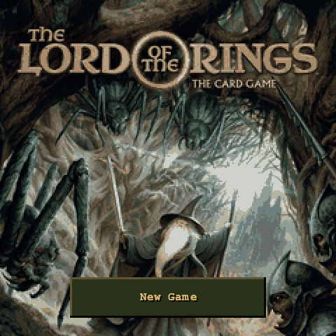 | 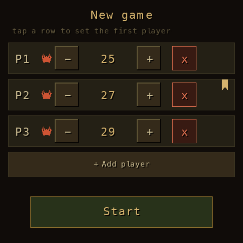 |

**Boot** — pixelated Revised Core Set box art. *Resume Game* restores the
saved game (round, phase, and save time shown); *New Game* starts over.
**New game** — add up to 4 players, set each one's starting threat (the sum
of their heroes' threat costs; default 25), tap a row to hand someone the
first-player ribbon, then *Start*.

### One-time setup phase

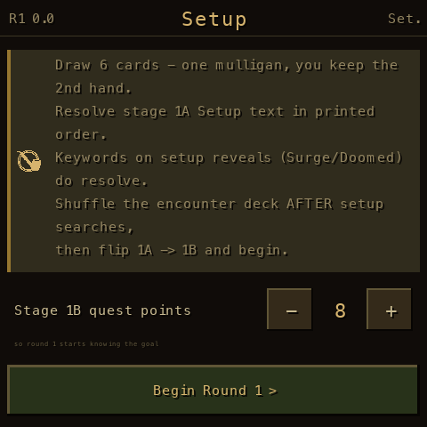

Before round 1 the HUD walks the rulebook's setup, focused on the part
everyone gets wrong: **the order of effects during quest setup** — resolve
stage 1A's Setup text in printed order (keywords on setup reveals *do*
resolve), shuffle the encounter deck *after* any setup searches, then flip
1A → 1B. Set stage 1B's quest points here so round 1 starts with the goal
known.

### The guided round

| | |
|---|---|
| 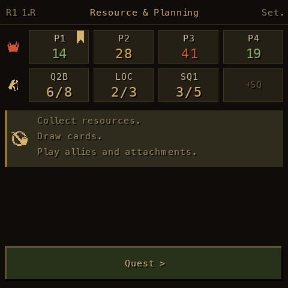 | 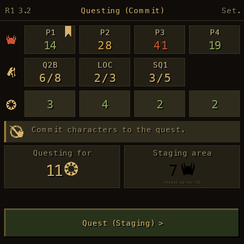 |
| 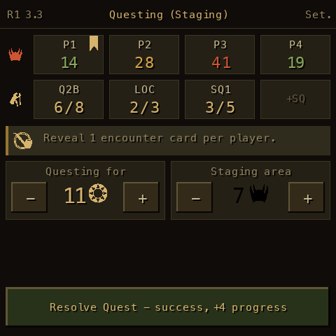 | 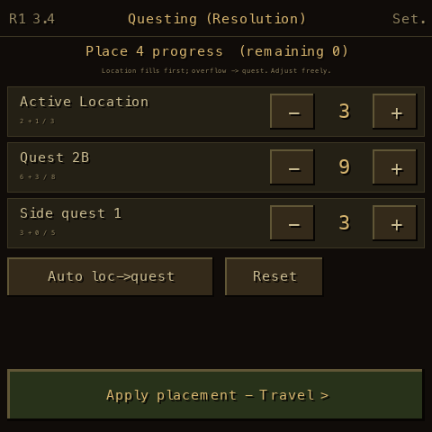 |
| 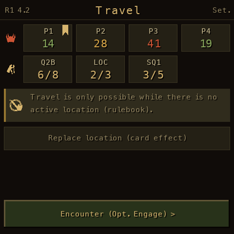 | 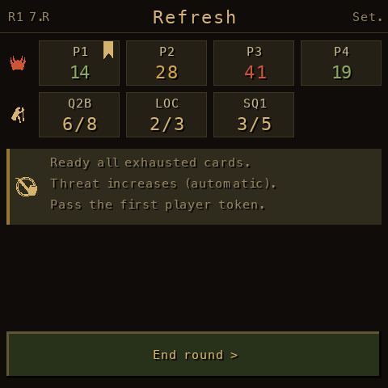 |

Every stage of the round is its own view; the button at the bottom is always
the next thing to do.

- **Header** is the nav: tap `R# <step>` for the **Game Log**, the phase name
  for **Game Phases**, `Set.` for **Settings**. The step notation
  (`1.R`, `3.4`, `6.E`) matches the official turn-sequence chart.
- **Threat row** (helm) is always visible — tap a player card to edit their
  threat; crossing a player's elimination level pops a confirmation
  (eliminated / averted by card effect / level changed).
- **Progress row** (trail icon) shows quest / active location / side quests —
  tap any card to adjust its progress, `+SQ` to add side quests during
  Planning or Staging.
- **Questing** — commit willpower per player (tap a WP card to cycle through
  everyone, or the *Questing for* card to edit all at once), reveal during
  Staging with a high-end estimate of incoming threat, then resolve: success
  opens a placement view (location fills first, overflow to the quest — or
  place by hand), failure raises everyone's threat by the shortfall.
- **Travel** subtracts the traveled location's threat contribution from the
  staging area automatically.
- **Refresh / End round** raises threat by each player's per-round setting,
  passes the first-player token, and logs round stats (duration, threat
  deltas, progress gained).

### Reference screens

| | |
|---|---|
| 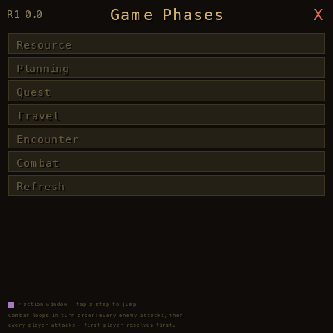 | 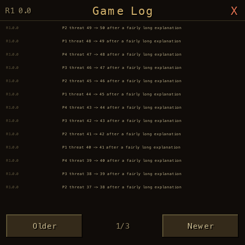 |

**Game Phases** — the full official turn sequence with the current step
highlighted; purple squares mark player action windows, and the combat loop
(every enemy attacks, then every player attacks, in turn order) is called
out. Tap any step to jump the tracker there.
**Game Log** — everything that happened, newest first, tagged
`R<round>.<step>` with session timestamps.

### Notifications & reminders

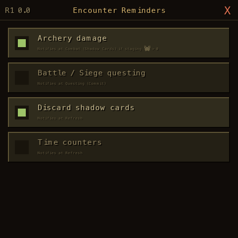

Tap the center of the *Staging area* card to open **Encounter Reminders** —
opt-in notifications for the effects everyone forgets: Archery damage (only
fires while staging threat > 0), Battle/Siege questing, shadow-card discard,
Time counters. Enabled reminders appear as timed banners at the start of the
matching phase with a pac-man countdown; action windows announce themselves
in Leadership purple.

### Settings

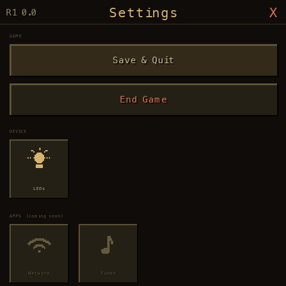

*Save & Quit* returns to boot with the game saved; *End Game* (with confirm)
wipes the save. The LEDs tile controls the 7-LED strip: brightness plus
scenes — phase colors with a danger center, danger only, torchlight flicker,
or off. (The web twin renders the strip under the screen.)

## Web twin ↔ firmware

```
docs/           the web twin (GitHub Pages)
  js/           ES-module port, file-for-file mirror of the Python
  assets/       boot art
gamestate.py    pure game logic (host-tested)
phases.py       official turn-sequence data (from the DragnCards plugin)
ui/             PicoGraphics screens, modals, icons, theme
tools/          preview renderer, web-data generator
tests/          266+ host tests incl. a 63-check layout linter
```

The twin shares the firmware's architecture — same screens, same button
protocol, same bitmap8 text metrics, same palette — so a feature built on the
web ports to MicroPython mechanically. `tools/gen_web_data.py` regenerates
the shared data modules (turn sequence, icon masks, font metrics) from the
Python source.

## Running the firmware

```sh
pip install mpremote
mpremote connect <port> fs cp gamestate.py phases.py leds.py hardware.py main.py :
mpremote connect <port> fs mkdir :ui
mpremote connect <port> fs cp ui/*.py :ui/
mpremote connect <port> fs cp assets/boot_bg.png :
```

`main.py` auto-runs on boot. Host tests: `python -m pytest tests/`.

## Credits

- Turn-sequence data from the
  [DragnCards LOTR LCG plugin](https://github.com/seastan/dragncards-lotrlcg-plugin)
- Game iconography from
  [KevBelisle/lotr-lcg-assets](https://github.com/KevBelisle/lotr-lcg-assets)
- *The Lord of the Rings: The Card Game* is © Fantasy Flight Games /
  Middle-earth Enterprises. This is an unofficial fan-made companion for
  personal use at the table.
