# LOTR LCG Tracker

A touchscreen companion for **The Lord of the Rings: The Card Game** — a
tablet app that walks the official turn sequence, tracks threat and quest
progress, teaches where the action windows are, and keeps a timestamped log of
the whole game.

**[Open it → lotrlcg.app](https://lotrlcg.app/)** · no install, no account,
works offline once loaded.

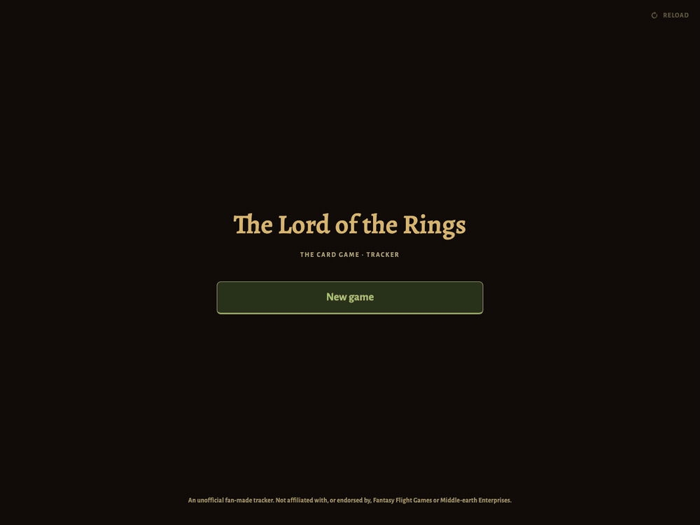

> [!WARNING]
> **Alpha, and under active design work.** It is usable at the table today,
> but screens, copy and layout change between releases. See
> [Status and roadmap](#status-and-roadmap).

It is a **manual companion tracker, not a rules engine**: you tap to adjust
state, and it never blocks a retcon. What it brings is the structure — the
official step order, what may be played when, the numbers the cards actually
print, and a running record of what happened.

## What it does

|  |  |
|---|---|
| 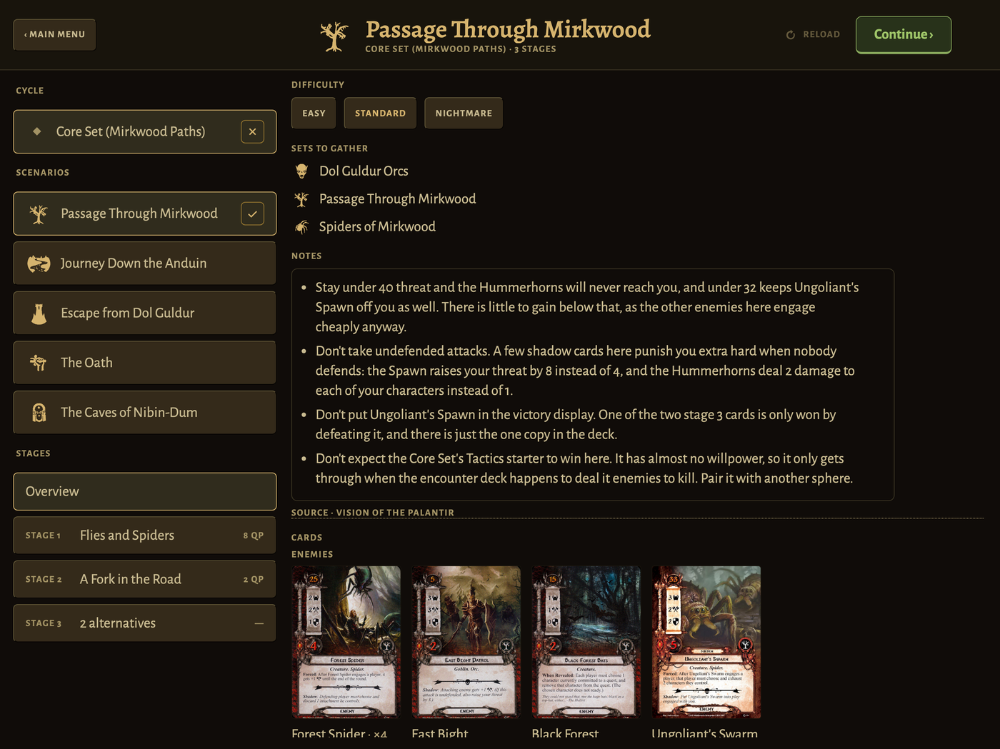 | 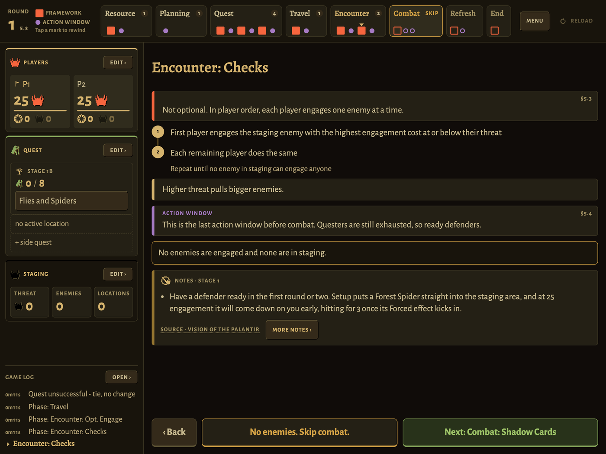 |

**Pick a quest, see what you are walking into.** Every scenario in the card
pool, grouped by cycle, with the encounter sets it gathers, the cards it can
put into play, per-stage quest points, and strategy notes written for that
scenario and that stage.

**Play a round with the rules at your elbow.** Each step of the turn gets its
own screen: what happens automatically, and — in purple, called out
separately — the **action windows**, the only times an Action may be
triggered. The phase timeline across the top shows the whole round at a
glance, and every mark the round has reached is a tap-to-rewind target.

**Look up a card without leaving the table.** Any card in the scenario opens
full size, with its printed text and a table of what it actually costs you.

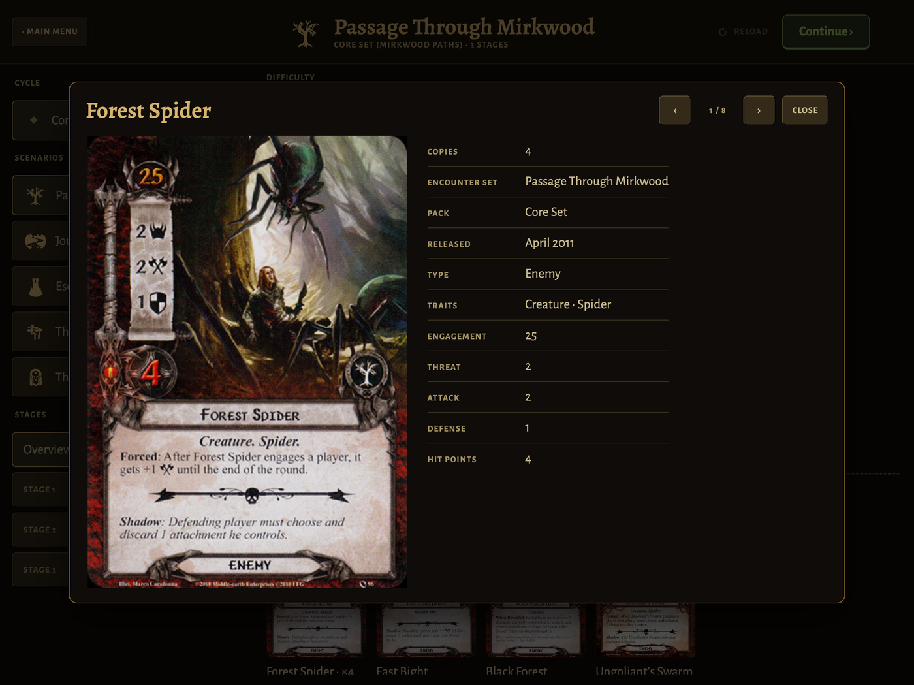

Also in there: per-player threat and elimination levels, staging area
tracking, engaged-enemy counts, location travel with its threat contribution,
side quests, a guided quest-resolution flow, the Rules Reference sections
behind each step, and a filterable game log you can rewind through or export.

## Status and roadmap

| | |
|---|---|
| **Stage** | Alpha — usable, unfinished, changing |
| **Live** | [lotrlcg.app](https://lotrlcg.app/) (released) |
| **Preview** | [andrhamm.com/lotr-lcg-presto-hud](https://andrhamm.com/lotr-lcg-presto-hud/) (tip of `main`) |
| **Changes** | [CHANGELOG.md](CHANGELOG.md) · [Releases](../../releases) |

**Now:** a design pass over every screen — layout, type scale, iconography,
and cutting anything that says the same thing twice.

**Next, roughly in order:**

- **Long-form scenario notes.** The advice was written to fit a 240×240
  screen, one clause per tip. A full-length version for the tablet is landing
  scenario by scenario (1 of 122 so far).
- **Classified notes** — pacing, what to do before you advance, what to watch
  for, what to avoid, player-count effects — instead of one undifferentiated
  list.
- **Campaign mode** tracking across a saga's scenarios.
- **Deck lists** alongside the quest, so the tracker knows what you brought.

**Not planned:** enforcing rules, playing the game for you, or anything that
needs an account.

## Releases and deploys

`main` is a preview channel. Merging a feature branch publishes the preview
mirror and opens (or updates) a **release-please** release PR carrying the
version bump and the changelog — it does **not** touch the live site.
Production moves when that release PR is merged: that cuts the tagged GitHub
Release, attaches the built site to it, and publishes to lotrlcg.app.

```
feature branch ──merge──▶ main ──▶ tests, build, preview mirror
                                └─▶ release PR (opened/updated, not deployed)

release PR ────merge──▶ tag + GitHub Release ──▶ lotrlcg.app
```

Commits use [Conventional Commits](https://www.conventionalcommits.org/)
(`feat:`, `fix:`, `docs:`, `ci:`, …) — that is what the changelog is built
from, so the type and scope on a commit are load-bearing.

## The Presto firmware

The project started as custom MicroPython firmware for the
[Pimoroni Presto](https://shop.pimoroni.com/en-us/products/presto) (480×480
IPS touch, RP2350B), and that firmware is still here and still maintained —
but it is no longer the primary target. The tablet client is.

A pixel-faithful web twin of the device build runs at
**[lotrlcg.app/presto/](https://lotrlcg.app/presto/)** if you want to see what
it looks like without buying hardware.

<details>
<summary><b>The device build, screen by screen</b> (480×480 device pixels)</summary>

### Boot & setup

| | |
|---|---|
| 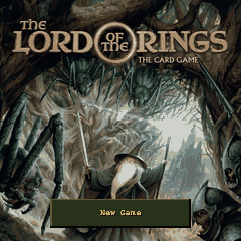 | 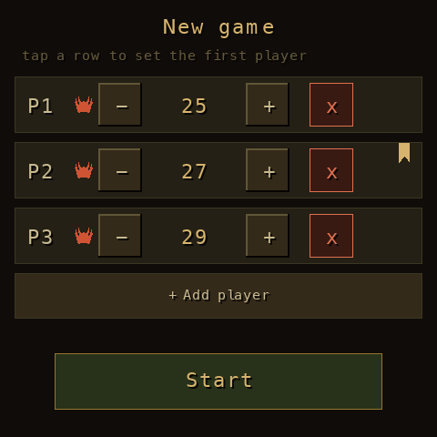 |

**Boot** — pixelated Revised Core Set box art. *Resume Game* restores the
saved game (round, phase, and save time shown); *New Game* starts over.
**New game** — add up to 4 players, set each one's starting threat (the sum
of their heroes' threat costs; default 25), tap a row to hand someone the
first-player ribbon, then *Start*.

### One-time setup phase

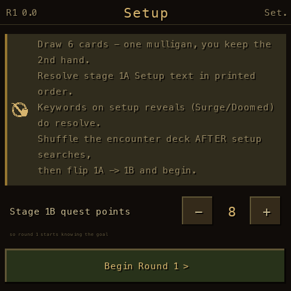

Before round 1 the HUD walks the rulebook's setup, focused on the part
everyone gets wrong: **the order of effects during quest setup** — resolve
stage 1A's Setup text in printed order (keywords on setup reveals *do*
resolve), shuffle the encounter deck *after* any setup searches, then flip
1A → 1B.

### The guided round

| | |
|---|---|
| 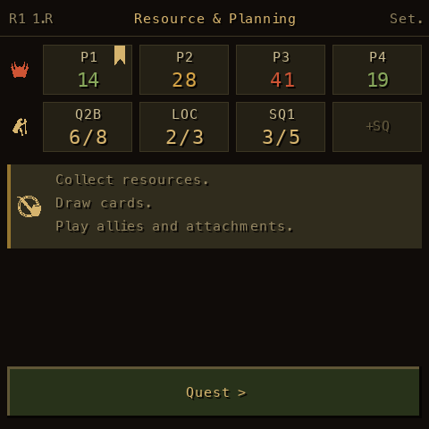 | 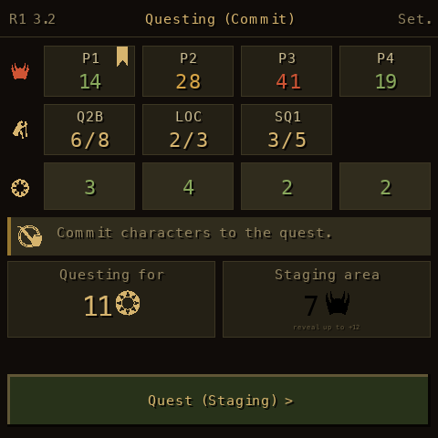 |
| 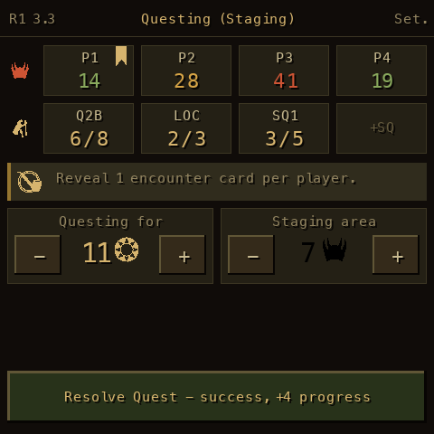 | 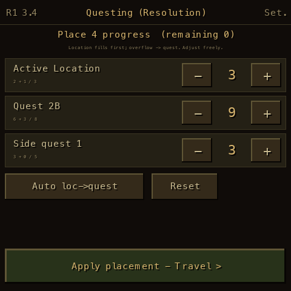 |
| 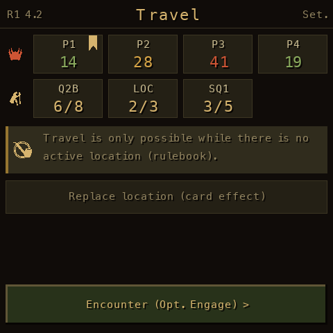 | 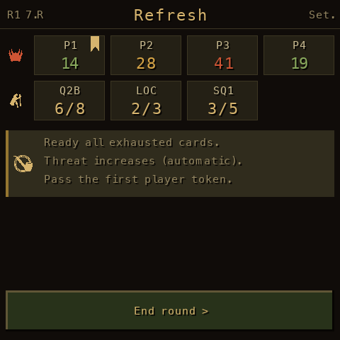 |

Every stage of the round is its own view; the button at the bottom is always
the next thing to do. The header is the nav: tap `R# <step>` for the **Game
Log**, the phase name for **Game Phases**, `Set.` for **Settings**. The step
notation (`1.R`, `3.4`, `6.E`) matches the official turn-sequence chart.

### Reference, reminders, settings

| | |
|---|---|
| 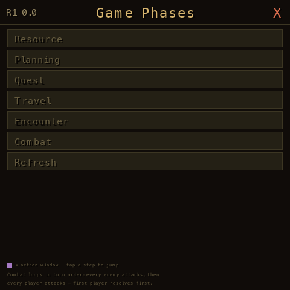 | 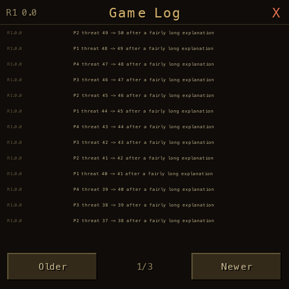 |
| 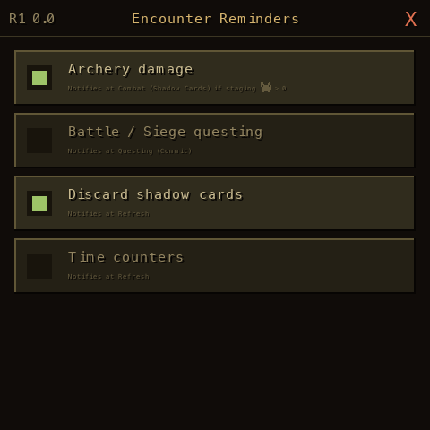 | 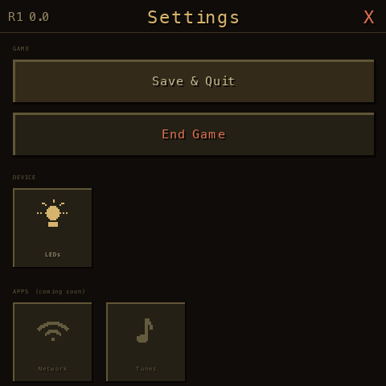 |

**Game Phases** — the full official turn sequence with the current step
highlighted; purple squares mark player action windows. **Game Log** —
everything that happened, tagged `R<round>.<step>`. **Encounter Reminders** —
opt-in notifications for the effects everyone forgets (Archery, Battle/Siege,
shadow-card discard, Time counters). **Settings** — save & quit, end game, and
the 7-LED strip (phase colours, danger, torchlight, off).

### Running it

```sh
pip install mpremote
mpremote connect <port> fs cp gamestate.py phases.py leds.py hardware.py main.py :
mpremote connect <port> fs mkdir :ui
mpremote connect <port> fs cp ui/*.py :ui/
mpremote connect <port> fs cp assets/boot_bg.png :
python3 tools/build_card_data.py && mpremote cp -r docs/data/ :/data/
```

`main.py` auto-runs on boot.

</details>

## Repo layout

```
docs/             the web app (this is what deploys)
  index.html      the tablet client
  tablet/         its renderers, styles and data
  presto/         the Presto web twin
  js/             shared game logic + data client, ES-module port of the Python
gamestate.py      pure game logic (host-tested)
phases.py         official turn-sequence data
ui/               the firmware's screens, modals, icons, theme
tools/            data builders (card DB, icons, catalog pack, tips)
tests/            ~2600 host tests, incl. a layout linter over every screen
```

Three clients share one model. The tablet and the Presto twin are both ES
modules over the same `docs/js/`; the firmware is the Python those were ported
from, and `tools/gen_web_data.py` regenerates the shared data so the two
cannot drift.

## Development

```sh
python3 -m pytest tests/        # the whole suite
python3 tools/build_card_data.py && python3 tools/build_catalog_pack.py
python3 -m http.server -d docs  # then open http://localhost:8000/
```

The card database is compiled from a pinned upstream TSV and is **not**
committed; run the build once before serving. See `CLAUDE.md` for the data
policy, the architecture notes, and the rules about never shipping an
unverified claim about the game.

## Disclaimer

An unofficial fan project, not endorsed, supported by, or affiliated with
Fantasy Flight Publishing, Inc. *The Lord of the Rings*, its characters and
game iconography are trademarks of Middle-earth Enterprises, used under
license by Fantasy Flight Games. Made for personal use at the table.
